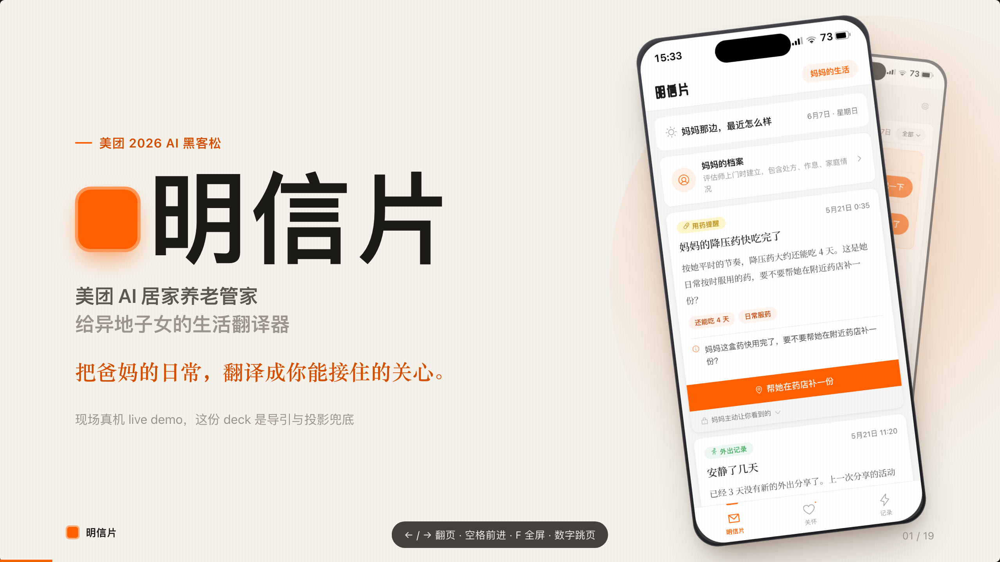
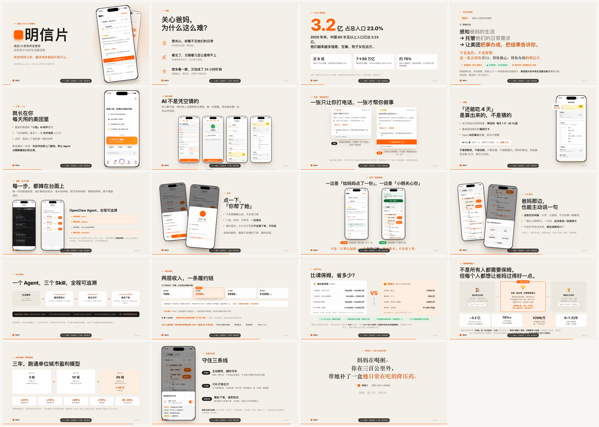
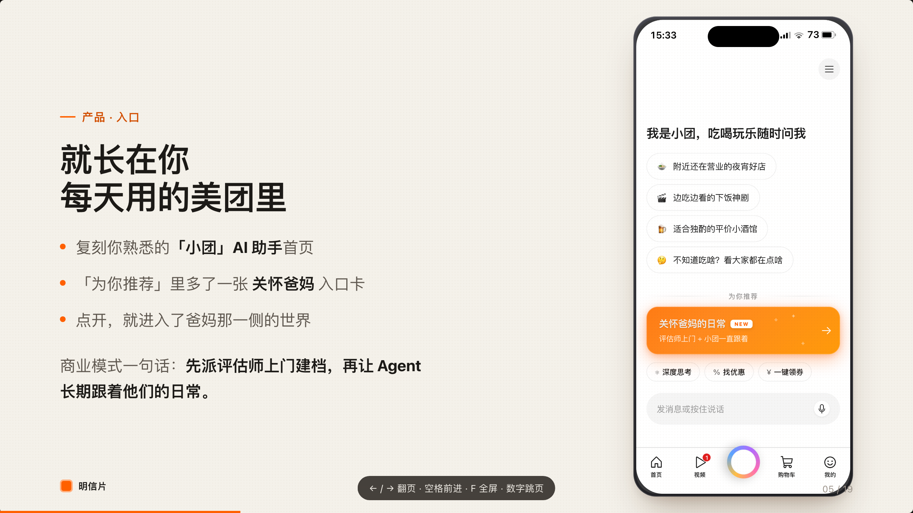
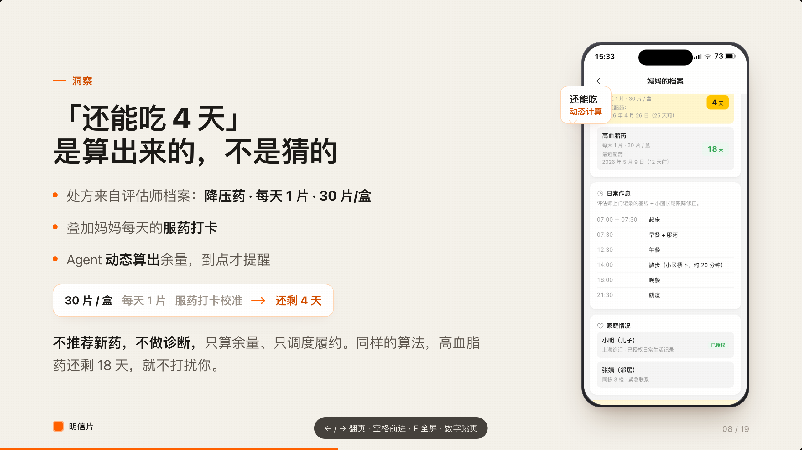
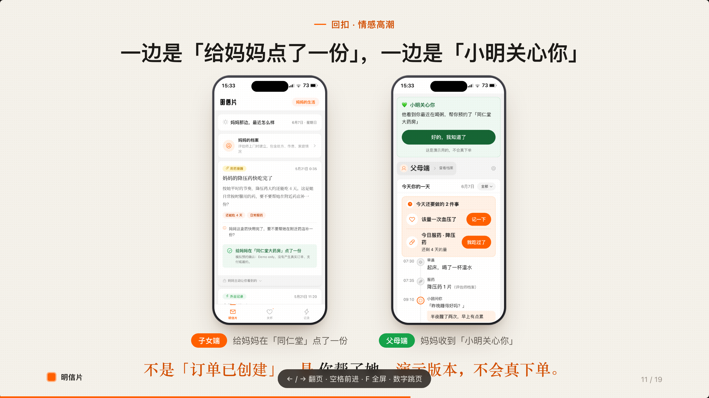
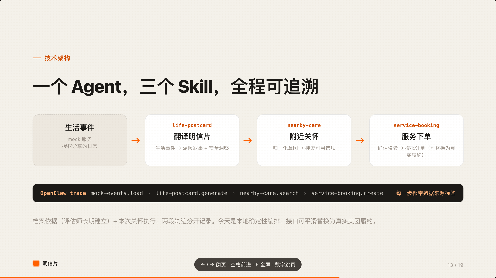
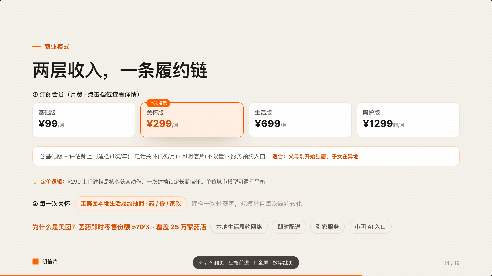

<div align="center">

# 明信片 · 美团 2026 AI 黑客松

**🏆 参赛作品 · 一个寄生在美团 App 内的 AI 居家养老管家**

</div>



> 异地子女远程照护空巢父母:AI 把爸妈的日常写成温暖的明信片,主动发现需求,再让美团本地生活网络把事办成——「妈妈的降压药快吃完了」,今天就变成「同仁堂大药房已送达」。

---

## 📽 路演 Deck 一览 — 19 页,纯手写 HTML 动画

这套 Deck **不是 PPT 模板套出来的**,而是一个**自包含的单文件 HTML 全屏动画演示**:`index.html` + GSAP,19 页一镜到底,可离线放映、可 `?slide=N` 逐页精准渲染。



### 几页关键设计

**① 长在你每天用的美团里** — 关怀不是又一个要下载的新 App,而是美团首页「为你推荐」的一张卡。



**②「还能吃 4 天」是算出来的,不是猜的** — 评估师上门建档做冷启动地面真值,此后 Agent 持续学习服药打卡 / 饮食规律,越用越懂爸妈。



**③ 一边「给妈妈点了一份」,一边「小明关心你」** — 一次远程关怀,两端同时被看见,这是产品的情感内核。



**④ 一个 Agent,三个 Skill,全程可追溯** &nbsp;|&nbsp; **⑤ 两层收入,一条履约链**

 

> 🎨 **这套 Deck 的前端做法**:单文件 `index.html`(无构建、无框架、无依赖)+ GSAP 驱动逐页入场动画 + 一套自定义 CSS 设计系统(色彩 / 字重 / 留白 / 设备框统一)。再配一条自动化出片流水线——`render.mjs`(Playwright 把每页渲成 2560×1440 PNG)、`capture-screens.mjs`(自动抓真机产品 UI 的纯屏内容)、`build_exports.py`(渲染图 → PPTX + PDF + 逐页讲稿)。从 HTML 到投影仪兜底,一键成片。

---

## 项目介绍

「明信片」是一个寄生在美团 App 内的 **AI 居家养老管家**,帮助异地子女远程照护空巢父母。

中国有 3.23 亿 60 岁以上老人,其中约 90% 处于生活自理阶段——他们不需要保姆、不需要养老院,但子女在几百公里外,不知道她今天吃了吗、药吃了吗、家里冷不冷。请保姆太贵太早不划算,什么都不做心里又放不下。明信片要填补的正是这个空白。

产品核心逻辑分三层:**感知翻译**——AI 把爸妈的日常写成温暖的明信片推送给子女("妈妈今天喝粥,吃得清淡");**托管照护**——AI 主动发现需求替子女操心("降压药还剩 4 天了,要不要帮她补?");**履约闭环**——子女一键确认,美团本地生活网络把事办成再回你一句"办妥了"(同仁堂送药上门、"你帮了她")。

**这个 Agent 的核心壁垒在于它会越用越懂爸妈。** 上线第一天,评估师上门把处方、作息、既有诊断清点清楚——这是冷启动的地面真值。之后每一天,AI 持续学习爸妈的服药打卡、饮食规律、生活节奏:降压药 30 片每天 1 片,吃了 26 天就还剩 4 天——不是猜的,是动态算出来的。同样的逻辑,高血脂药还剩 18 天,它就不打扰你。它知道什么时候该提醒、提醒什么、用多急的语气。它不是一次性配置的规则引擎,而是一个会持续积累、持续校准、越跑越精准的家庭照护模型。同一个爸妈,用一个月和用一年,Agent 对他们的了解是完全不同的深度。

为什么这件事只有美团能做:美团同时掌握了本地履约网络、即时配送、到家服务和 AI 助手入口。把"妈妈的降压药快吃完了"在今天变成"同仁堂大药房已送达"——这张网,目前只有美团真正跑通。

商业上采取订阅分层:基础版 ¥99/月、关怀版 ¥299/月(核心档,含上门建档+明信片+电话关怀)、生活版 ¥699/月(含上门探访+跑腿)、照护版 ¥1,299 起/月(含陪诊),另叠加每次关怀走美团本地生活履约抽佣。关怀版 ¥299 仅为一线城市住家保姆费用的二十分之一——不是替代保姆,而是用不到十分之一的成本解决子女 80% 的焦虑。

技术实现上,OpenClaw Agent 串联三个 Skill(life-postcard → nearby-care → service-booking),评估师上门建档提供初始地面真值,此后 Agent 持续从爸妈的日常数据中自主学习,动态追踪余量、校准提醒节奏、沉淀长期照护画像。所有数据来源标注四级诚实标签(mock/fallback/real_api 未接入/simulated),大方写在屏幕上,不假装真实。

---

## 路演材料

| 文件 | 用途 |
|---|---|
| `index.html` | **路演主 Deck** — 双击在 Chrome 中打开,19 页全屏动画放映 |
| `明信片-路演.pptx` | 可编辑 PowerPoint,每页含演讲者备注 |
| `明信片-路演.pdf` | 投影仪 / 无网络环境兜底 |
| `路演讲稿.md` | 19 页逐页口播词 + 评委 Q&A |

**操作:** `→` / `空格` 前进 · `←` 后退 · `F` 全屏 · 数字键跳页 · 点击屏幕左右半区翻页

---

## Live Demo 源代码

产品的真机 UI Demo(React 前端 + OpenClaw Agent + Mock API)托管在队友仓库:

👉 **[github.com/chrisnch/meituan-life-postcard-agent](https://github.com/chrisnch/meituan-life-postcard-agent)**

本仓库 Deck 中的产品截图均截取自该 Demo 的真实运行画面。

---

## 仓库结构

```
meituan-pitch-deck/
├── index.html                  19 页自包含动画 Deck(纯手写 HTML + GSAP)
├── 明信片-路演.pptx            可编辑 PPT
├── 明信片-路演.pdf             PDF 备份
├── 路演讲稿.md                 讲稿 + Q&A
├── assets/
│   ├── deck/                   README 用的 Deck 页截图(本页所见)
│   ├── screens/                15 张纯屏幕截图
│   ├── shots/                  22 张产品 UI 原图
│   └── vendor/gsap.min.js      GSAP 动画库(离线可放映)
├── capture-screens.mjs         截图采集脚本(Playwright)
├── capture-cards.mjs           卡片特写采集脚本
├── render.mjs                  Deck 渲染为 PNG
├── sweep-live.mjs              19 页排版全量检查
└── build_exports.py            渲染图 → PPTX + PDF + 讲稿
```

---

## 数据诚实声明

- 市场数据来源:国家统计局 2025 年人口数据、民政部公报、国家卫健委口径,已核实
- 产品内生活事件为本地样例(mock)、药店为降级样例(real_api 尚未接入)、下单为模拟交易
- 所有标签大方写在了屏幕和 trace 面板中,不假装真实

---

## 团队

| 角色 | 贡献 |
|---|---|
| **产品 & Demo UI** | Chris 团队 — React 前端 + OpenClaw Agent + 商业计划 |
| **路演 Deck & 设计** | Xilai Wang — 19 页动画 Deck + CSS 设计系统 + 截图自动化 |
| **后端 & Agent** | Mock API Server + 3 个 OpenClaw Skill |

---

*🤖 路演 Deck 由 Claude Code 辅助生成 & 排版验证*
